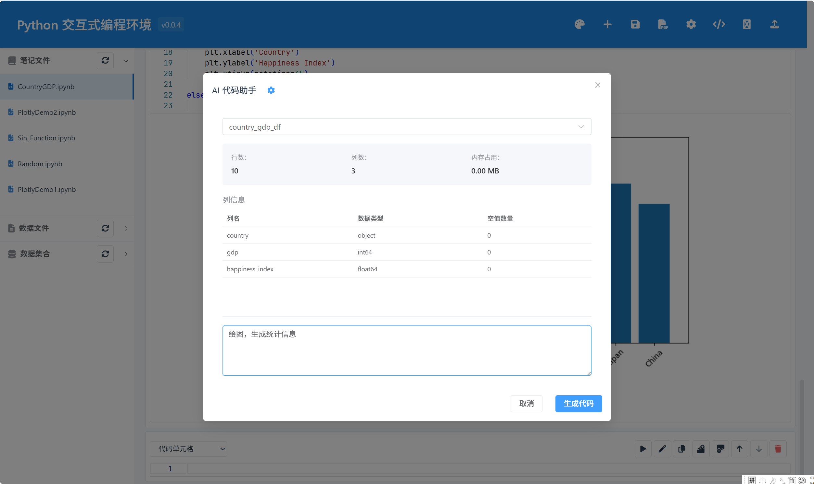
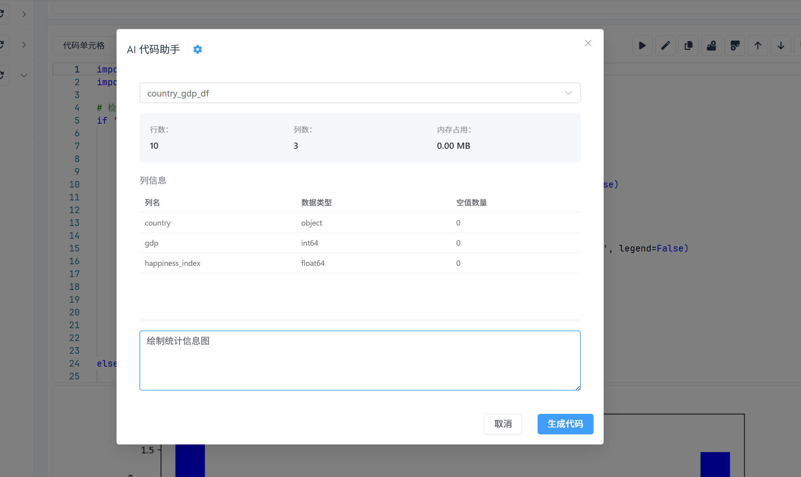
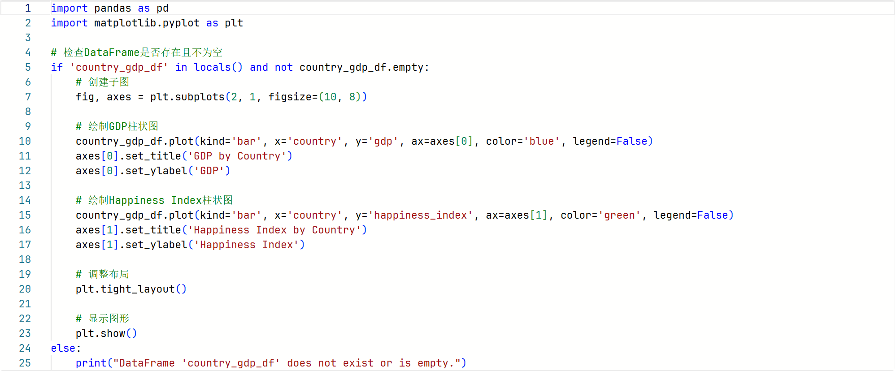
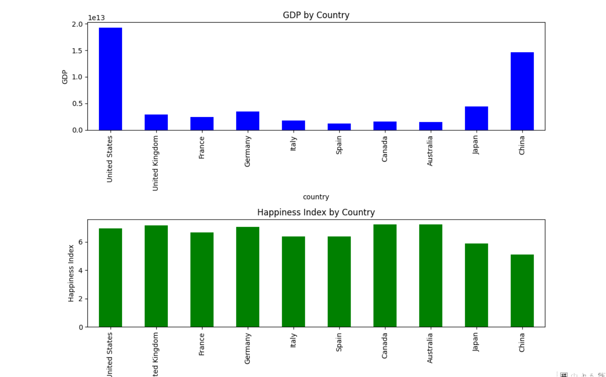

# Python数据分析笔记本

一个基于Web的Python数据分析工具，集成了Jupyter笔记本的功能和AI辅助代码生成能力。

## 功能特性

### 系统效果






系统采用现代化的界面设计，主要包括：
- 左侧可折叠的文件管理面板，支持笔记本、数据文件和数据集的管理
- 中间区域为笔记本编辑区，支持代码和Markdown单元格
- 顶部工具栏提供主题切换、文件操作、单元格添加等功能
- 内置AI代码助手，支持自然语言生成代码

### 1. 笔记本基础功能
- Markdown和代码单元格支持
- 实时代码执行
- 执行结果实时显示
- 单元格操作（添加、删除、移动）
- 代码自动补全和语法高亮
- 可调整布局的文件管理面板

### 2. 数据管理功能
- 支持CSV和Excel格式文件上传
- 文件管理（预览、删除）
- 数据基本信息显示
- 数据内容预览
- DataFrame操作和管理
- 折叠式文件和数据集列表

### 3. AI代码生成助手
- 智能代码生成
- DataFrame信息实时展示
- 自然语言转Python代码
- 代码示例一键插入
- 支持数据分析常用操作
- 可配置的AI系统提示词

### 4. 数据可视化支持
- 集成Matplotlib和Seaborn
- 支持多种图表类型
- 可视化代码智能生成
- 图表实时预览

### 5. 系统配置管理
- AI提示词在线配置
- 配置版本控制
- 一键重置默认配置
- 实时保存和加载

## 技术栈

### 前端
- Vue 3
- Element Plus
- Monaco Editor
- TypeScript
- Vite

### 后端
- FastAPI
- Python 3.10+
- Pandas
- NumPy
- Matplotlib
- DeepSeek API

## 安装说明

### 环境要求
- Python 3.10 或更高版本
- Node.js 16 或更高版本
- npm 8 或更高版本

### 后端安装
1. 创建虚拟环境：
```bash
python -m venv .venv
source .venv/bin/activate  # Linux/Mac
.venv\Scripts\activate     # Windows
```

2. 安装依赖：
```bash
pip install -r requirements.txt
```

3. 配置环境变量：
```bash
cp .env.example .env
# 编辑 .env 文件，设置必要的环境变量
```

### 前端安装
1. 安装依赖：
```bash
cd frontend
npm install
```

## 启动服务

### 开发环境
1. 启动后端服务：
```bash
cd backend
uvicorn app.main:app --reload --port 8000
```

2. 启动前端服务：
```bash
cd frontend
npm run serve
```

### 生产环境
1. 构建前端：
```bash
cd frontend
npm run build
```

2. 启动服务：
```bash
cd backend
uvicorn app.main:app --host 0.0.0.0 --port 8000
```

## 使用指南

### 1. 数据导入
1. 点击工具栏的"上传文件"按钮
2. 选择CSV或Excel文件
3. 等待文件上传和预处理完成

### 2. 数据分析
1. 在代码单元格中编写Python代码
2. 使用AI助手生成代码：
   - 点击AI助手按钮
   - 选择要操作的DataFrame
   - 输入自然语言描述
   - 获取生成的代码

### 3. 数据可视化
1. 使用内置的可视化库创建图表
2. 通过AI助手生成可视化代码
3. 在笔记本中实时查看图表效果

## 版本历史

查看 [CHANGELOG.md](./CHANGELOG.md) 了解详细的版本更新历史。

## 贡献指南

1. Fork 本仓库
2. 创建特性分支：`git checkout -b feature/AmazingFeature`
3. 提交改动：`git commit -m 'Add some AmazingFeature'`
4. 推送分支：`git push origin feature/AmazingFeature`
5. 提交 Pull Request

## 许可证

本项目采用 MIT 许可证 - 查看 [LICENSE](LICENSE) 文件了解详情。

## 新架构说明
├── composables/    # 组合式API模块
├── stores/         # Pinia状态管理
└── components/     # 组件分类
    ├── layout/     # 布局组件
    └── notebook/   # 核心业务组件

